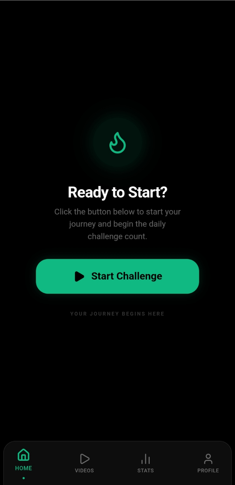
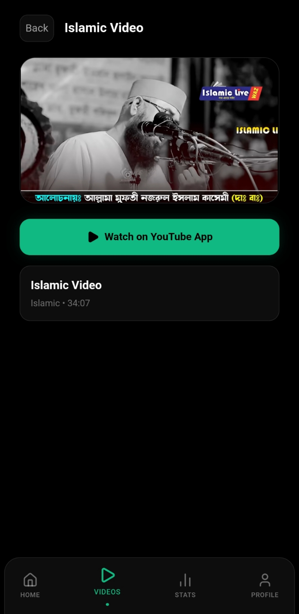
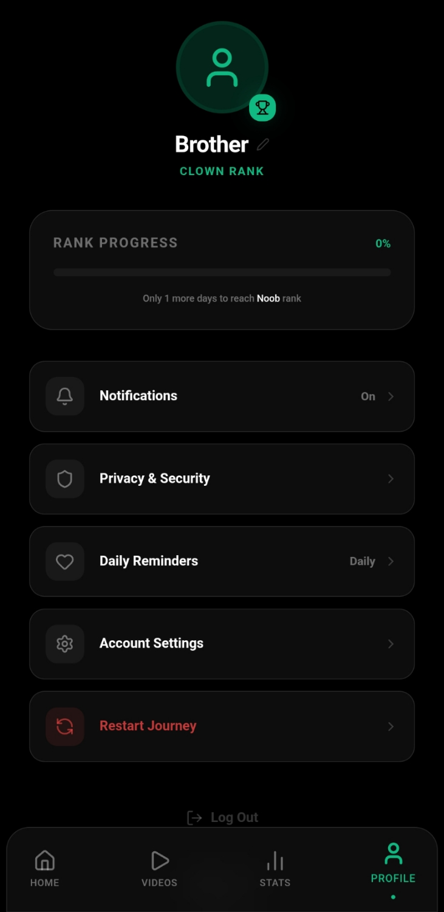
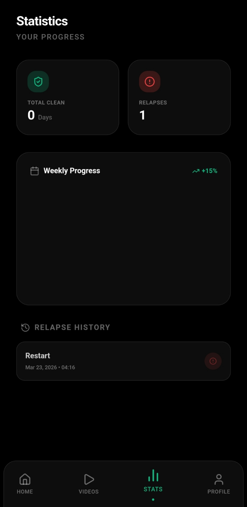

# 🌙 SabrTrack

**Stay Strong. Stay Clean.**

SabrTrack is a modern self-discipline and habit tracking mobile app designed to help users overcome bad habits, build consistency, and stay spiritually motivated with Islamic guidance.

---

## 📸 Screenshots

### 🏠 Home Screen

### 🎬 Video Screen

### 🚨 Profile Dashboard

### 📊 Stats Dashboard

---

## ✨ Features

- 🔥 **Streak Tracker**  
  Track your daily progress and build strong habits.

- 🧠 **Urge Control System**  
  Breathing exercises, duas, and reminders to stay in control.

- 🎥 **Motivational & Islamic Videos**  
  Watch inspiring content to stay focused and disciplined.

- 🏆 **Badge System**  
  Unlock levels like Noob, Average, Sigma, and Chad.

- 📊 **Progress Analytics**  
  View your performance with streaks, relapse count, and stats.

- 📿 **Islamic Motivation**  
  Daily quotes and reminders.

- 📴 **Offline Support**  
  Access core features without internet.

---

## 📱 Screens

- Home Dashboard  
- Video Feed  
- Urge Control Screen  
- Stats Dashboard  
- Profile  

---

## 🛠️ Tech Stack

- **Flutter**
- **Dart**
- **Hive / SQLite**
- **Firebase / Supabase (optional)**

---
